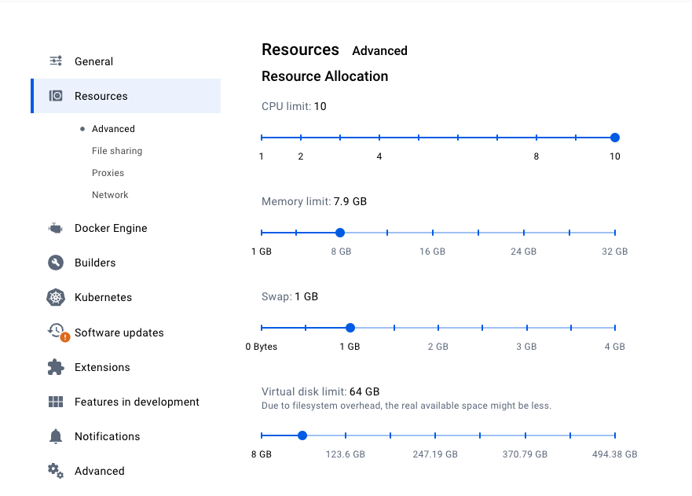
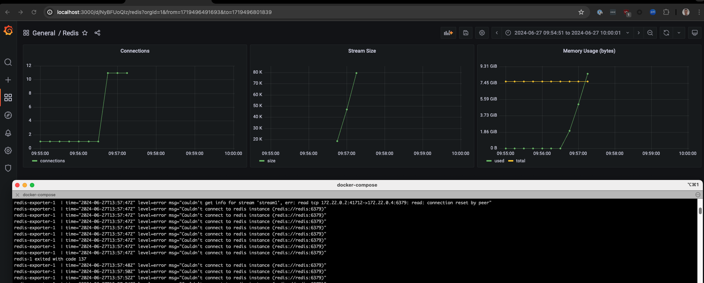
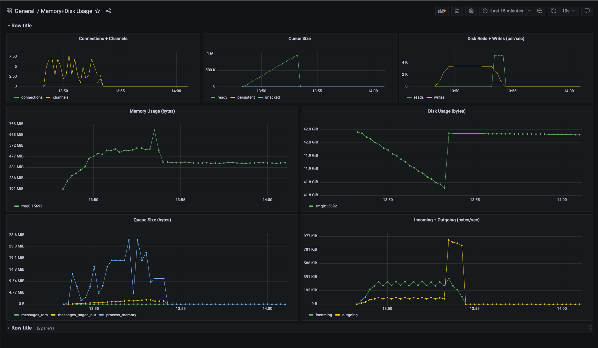

# A comparison of Message Brokers

## Setup 

### RabbitMQ/Prometheus/Grafana Stack

Setup: 
```bash
docker-compose -f docker/docker-compose.rabbitmq.yml up -d --remove-orphans
```

Teardown:

```bash
docker-compose -f docker/docker-compose.rabbitmq.yml down -v
```

> This will tear down attached volumes to reset Prometheus/Grafana metrics.

While docker is running, you can run tests:
    
```bash
go test -v --run "Test_RabbitMQ" ./backends/rabbitmq --timeout 20m
```

Go to http://localhost:3000/d/5qyVNpQIk/memory-disk-usage?orgId=1&from=now-15m&to=now&refresh=10s
to monitor RabbitMQ while the tests are running.

### Redis/Prometheus/Grafana Stack

Setup:

```bash
docker-compose -f docker/docker-compose.redis.yml up -d --remove-orphans
```

Teardown:

```bash
docker-compose -f docker/docker-compose.redis.yml down -v
```

> This will tear down attached volumes to reset Prometheus/Grafana metrics.

While docker is running, you can run tests:
    
```bash
go test -v --run "Test_Redis" ./backends/redis --timeout 20m
```


## Results

The test is as follows:

* Write 1M (million) messages to the broker. 
* Each message is a random alphanumeric string of size 100KB.
* Process them using a go-msg server (no errors).

Each test runs a broker (Rabbitmq or Redis), Prometheus, Grafana, and optional exporter (to scrape metrics for Prometheus).
Each broker is configured for the default Docker resource allocations:



We're going to compare resource usage between the message brokers, to see if one is more viable.

**Redis** wrote ~100K messages before it got an OOM error (at 8GB memory), crashed, and then the tests failed.




**RabbitMQ** wrote all 1M messages while only using 500MB memory and ~200MB disk.
All messages were processed.


